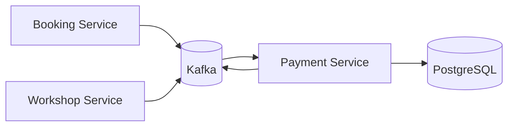
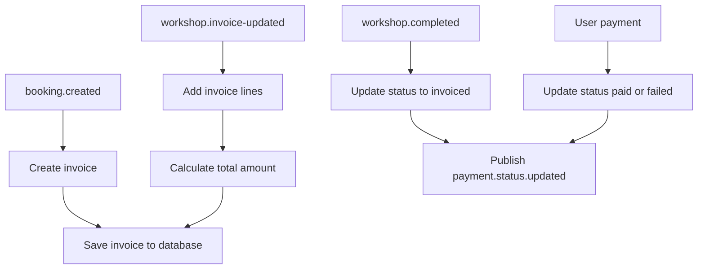
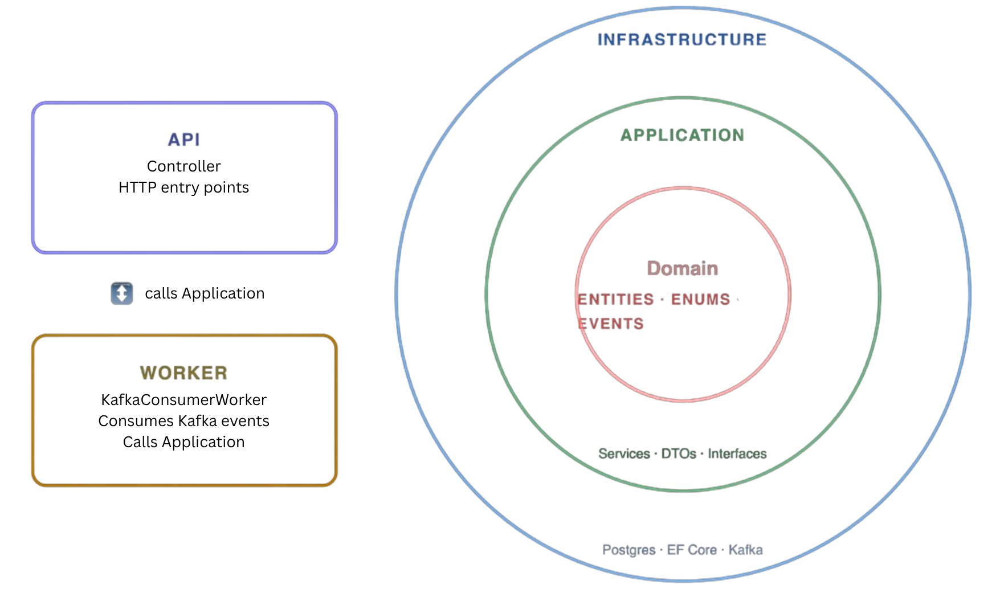
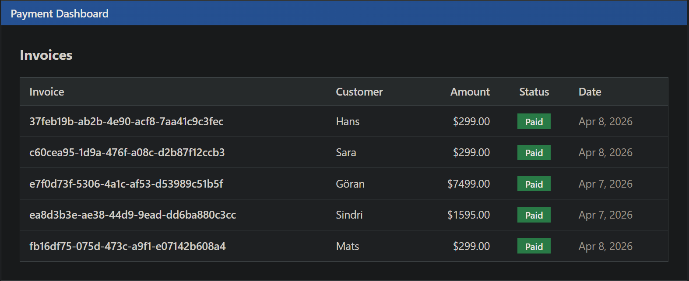
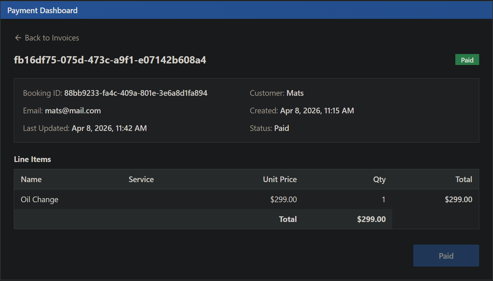

# Event Driven Payment Service

Event driven payment and invoice processing microservice built with .NET, Kafka, EF Core, and PostgreSQL.

This service is part of a distributed microservice architecture where all services communicate asynchronously through Kafka.

Main responsibility:

* consume booking and workshop events
* create and update invoices
* persist invoice state in PostgreSQL
* publish payment status updates to downstream services

## System Context

The service is part of a larger event driven platform consisting of:

* Booking Service
* Workshop Service
* Payment Service

All communication happens through Kafka topics.



## Application Flow



## Architecture

The service follows a clean architecture approach with separated API and worker entry points.  



<h2>Demo</h2>

<h3>Invoice Dashboard</h3>


<h3>Invoice Details</h3>


## Event Example

```json
{
  "eventId": "guid",
  "eventType": "payment.status.updated",
  "timestamp": "2026-03-27T10:00:00Z",
  "data": {
    "bookingId": "guid",
    "paymentId": "guid",
    "amount": 2400,
    "status": "paid"
  }
}
```

Allowed status values:

* pending
* invoiced
* paid
* failed

## Tech Stack

* .NET / ASP.NET Core
* Kafka
* Entity Framework Core
* PostgreSQL
* Clean Architecture
* Background Worker

## My Contributions

* designed the initial service architecture and aligned the final solution with team input
* implemented core payment and invoice business logic flow
* implemented invoice lifecycle handling
* contributed to event consumption flow
* database persistence debugging
* cross team event contract alignment
* integration testing with Kafka and Swagger
